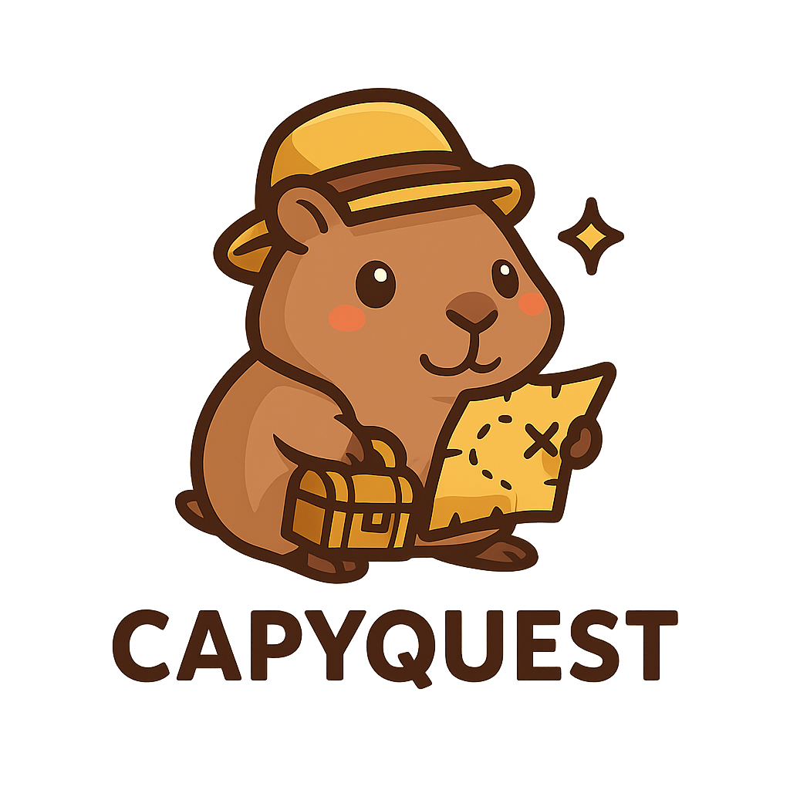
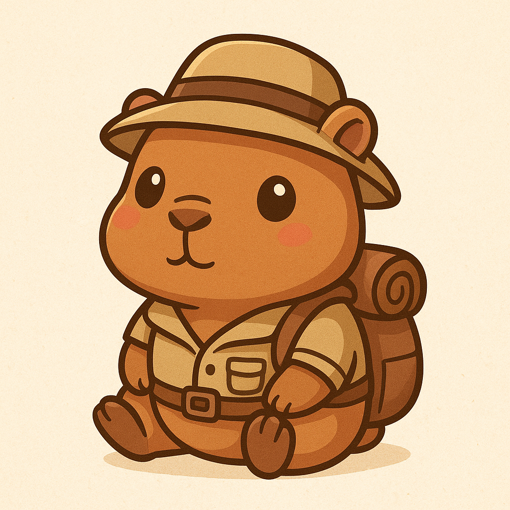
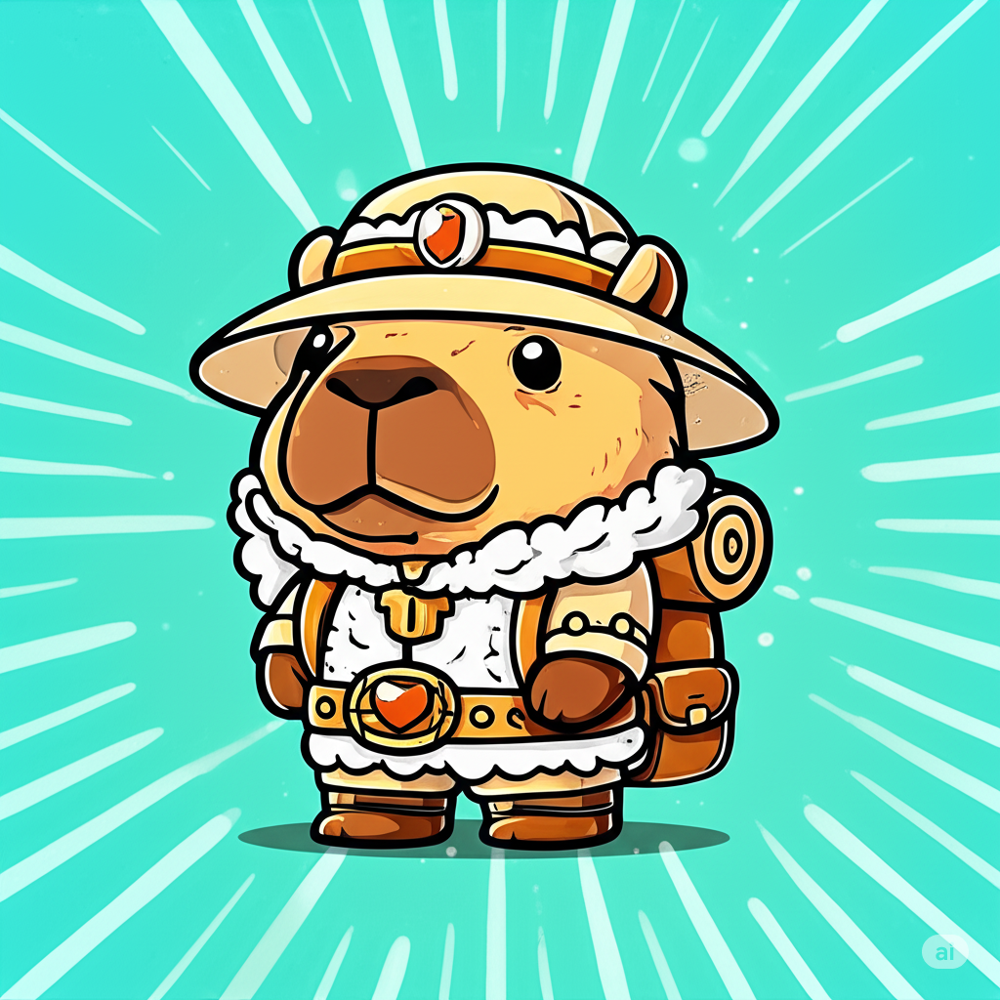
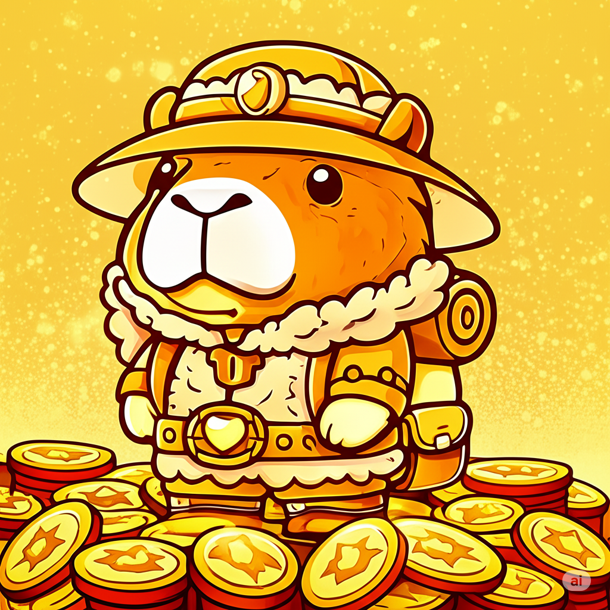

  

CapyQuest es un proyecto **Web3** desarrollado con **Solidity** para los smart contracts y **Next.js** para el frontend.  
Nuestra misión es crear un ecosistema divertido e interactivo alrededor de **CapyCoin**, combinando blockchain, geolocalización y próximas integraciones de **AR (Realidad Aumentada)**.  

🌍 Website: [CapyQuest](https://capy-quest.vercel.app/)

---

## 🖼 NFTs por Rareza

  
  
  
  
  

---

## 🚀 Funcionalidades Actuales
- Smart contracts escritos en **Solidity** para CapyCoin (ERC-20) y CapyNFT (ERC-721).  
- Frontend funcional en **Next.js**.  
- Comprar CapyCoins y mintear NFTs.  
- Distribución de NFTs en el mapa de manera **puntual o aleatoria**.  
- Reclamar NFTs cerca de su ubicación en el mapa.  
- NFTs pueden **venderse en el marketplace** o **quemarse para obtener CapyCoins**.  
- 5 rarezas de NFTs disponibles: Baby, Explore, Wise, Legendary, Golden.  
- Contratos desplegados en la **testnet Fuji** de Avalanche.  

---
## 🛠 Próximas Funciones (Stage 3)
- **Integración AR**: experiencia inmersiva para encontrar y reclamar NFTs.
---

## 🎯 Resumen del Modelo Económico

### Cazatesoros (Claim) - **GRATUITO**
- Cualquier persona puede reclamar NFTs distribuidos sin costo.  
- Solo necesita estar físicamente cerca del NFT.  
- No puede reclamar sus propios NFTs distribuidos.  

### Conversión a CapyCoin (Burn) - **Fee variable según rareza**
- Al quemar un NFT, el usuario recibe el **valor del NFT en CapyCoins menos el fee**.  
- Fee según el valor del NFT:
  - ≤ 5 CYC → 3%  
  - ≤ 20 CYC → 5%  
  - > 20 CYC → 7%  
- Este fee se transfiere al `feeRecipient`.  
- Única forma de retirar CapyCoins del contrato.  

### Reserva del Contrato
- CapyCoins se acumulan en el contrato al mintear NFTs.  
- Solo se liberan al quemar NFTs con fee.  
- No hay retiro directo de CapyCoins.  

### Incentivos del Juego
- **Distribuir**: jugadores reparten NFTs en el mapa para interactuar con su audiencia.  
- **Explorar**: los cazatesoros buscan NFTs para reclamarlos gratis.  
- **Convertir**: usuarios queman NFTs para obtener liquidez según el fee variable.  

💡 Este modelo crea un ciclo económico sustentable:  
- NFTs mantienen su valor.  
- Incentivo constante para explorar y reclamar.  
- Los ingresos del protocolo provienen solo de conversiones a CapyCoin.  
- Sin inflación descontrolada.  

---

## 📌 Roadmap

- **Semana 1**:  
  - Contrato CapyCoin funcional.  
  - Comprar y mintear NFTs.  
  - Publicar repositorio y roadmap.  

- **Semana 2**:  
  - Marketplace y trading de NFTs.  
  - Geospatial features avanzadas.  
  - Integración AR.  

---

## 📂 Tech Stack
- **Smart Contracts**: Solidity  
- **Frontend**: Next.js  
- **Blockchain**: Avalanche-AVAX  

---

## 🤝 Contribuciones
¡Contribuidores bienvenidos!  
Consulta nuestro roadmap y repositorio para comenzar.  

---

<!-- ## 📧 Contacto
Visítanos en [CapyQuest](https://capy-quest.vercel.app/) -->
